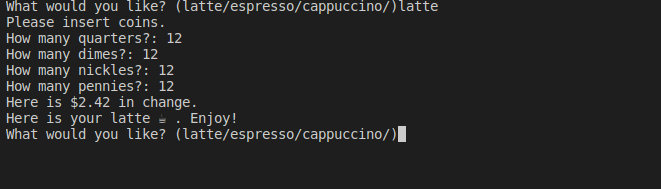

# Day16_OOP_Coffe_Machine
 
> Rebuilding Day15 project but using OOP
This is a coffee machine where you can order coffee and pay for it sadly we can't download the actual coffee

#### Preview:


## How to run this on your device

- Clone this repository
```
git clone https://github.com/kingdreamerr/Day16_OOP_Coffee_Machine.git
```
- cd into the repo
```
cd Day16_OOP_Coffee_machine
```

- Paste the following in the terminal 
```
python3 main.py
```
